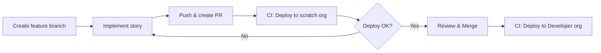

# CI/CD Setup Guide

**Project:** Organization-Contact-Profile  
**Last Updated:** February 2025

---

## 1. Overview

This project uses GitHub Actions for CI/CD:

| Workflow | Trigger | Purpose |
|----------|---------|---------|
| **PR Validation** | `pull_request` to `main` | Deploy to scratch org; must pass before merge |
| **Deploy on Merge** | `push` to `main` | Deploy to Developer org after merge |

---

## 2. Prerequisites

- **DevHub org** – Developer Edition (or higher) with DevHub enabled
- **Developer org** – Target org for post-merge deployments (can be same as DevHub for small teams)

---

## 3. GitHub Secrets

### 3.1 For PR Validation (Scratch Org)

| Secret | Description | How to Create |
|--------|-------------|----------------|
| `SF_DEVHUB_AUTH_URL` | DevHub auth URL (raw or base64) | See below |

**Create SF_DEVHUB_AUTH_URL (option A – raw URL, recommended):**

```bash
sf org login web --alias DevHub --instance-url https://login.salesforce.com
sf org display -o DevHub --verbose --json | jq -r .result.sfdxAuthUrl
# Copy output (starts with force://) and paste as GitHub secret
```

**Option B – base64:** Use if storing raw URL causes issues. Workflow supports both.

### 3.2 For Deploy on Merge

| Secret | Description | How to Create |
|--------|-------------|----------------|
| `SF_DEV_ORG_AUTH_URL` | Developer org auth URL (base64) | Same as above, using Developer org alias |

---

## 4. Branch Protection (Recommended)

Enforce PR validation and approvals before merge:

1. **Settings** > **Branches** > **Add branch protection rule** (or edit existing)
2. **Branch name pattern:** `main`
3. Enable:
   - **Require a pull request before merging**
   - **Require approvals** – set "Required number of approvals" to 1 (or more)
   - **Require status checks to pass before merging**
   - **Require branches to be up to date before merging**
4. **Status checks:** Click "Add" and select **`validate`** from the dropdown.  
   - If not listed, run the workflow once on a PR – the check will appear after the first run.  
   - The exact name may be `validate` or `Validate Deployment`.
5. Optional:
   - **Dismiss stale pull request approvals when new commits are pushed**
   - **Require review from Code Owners** (if CODEOWNERS is configured)

---

## 5. Development Workflow



1. Create branch: `git checkout -b feature/STORY-001-contact-fields`
2. Implement and commit: `[STORY-001] Add Summary and Headline to Contact`
3. Push and open PR: `main` as base branch
4. CI runs: Deploy to scratch org (must succeed)
5. After approval, merge
6. Post-merge CI deploys to Developer org

---

## 6. Workflow Details

### PR Validation

- **Runs on:** PR to `main` (when `force-app/**`, `config/**`, or `sfdx-project.json` change)
- **Steps:**
  1. Checkout code
  2. Install Salesforce CLI
  3. Authenticate to DevHub
  4. Create scratch org (1 day)
  5. Deploy metadata to scratch org
  6. Delete scratch org

If deploy fails, the PR cannot be merged (when branch protection is enabled).

### Deploy on Merge

- **Runs on:** Push to `main` (after merge)
- **Steps:**
  1. Checkout code
  2. Install Salesforce CLI
  3. Authenticate to Developer org
  4. Deploy metadata to Developer org

---

## 7. Troubleshooting

| Issue | Solution |
|-------|----------|
| `SF_DEVHUB_AUTH_URL` invalid | Regenerate auth URL; ensure base64 encoded |
| Scratch org creation fails | Verify DevHub is enabled; check org limits |
| Deploy fails | Check metadata; run `sf project deploy start` locally |
| Secret not found | Ensure secret name matches exactly; check repo vs org secrets |
| "validate Expected — Waiting for status" | Run workflow once on a PR; add the status check that appears (e.g. `validate`) to branch protection |
