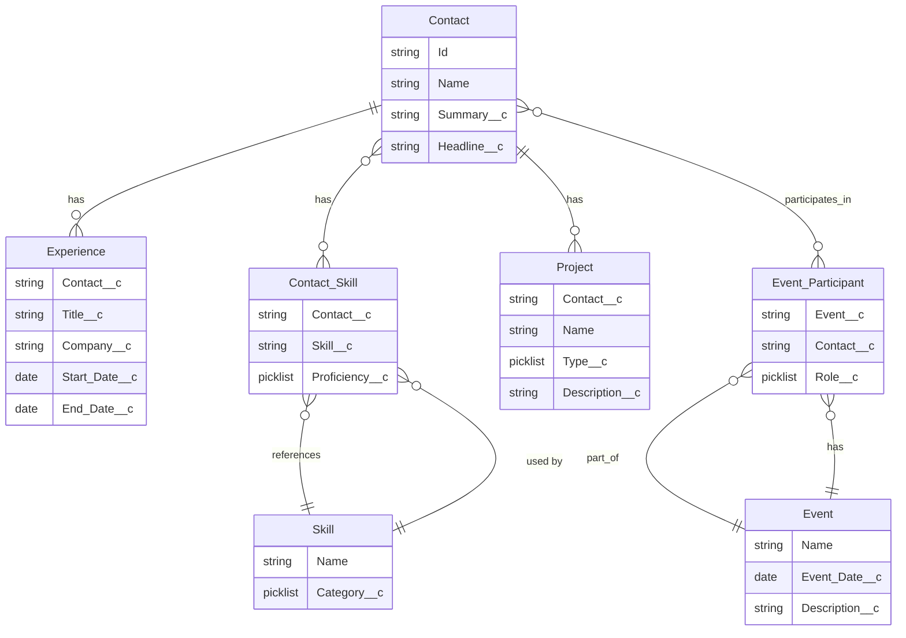

# Self Profile – Overall Detailed Project Plan

**Author:** Avanish Kumar  
**Version:** 1.0  
**Last Updated:** February 2025

---

## 1. Executive Summary

This project delivers a Salesforce solution for managing professional profiles that highlight Experience, Skills, Public/Private Projects, and Event participation. The solution is Contact-centric, uses standard Salesforce features wherever possible, and supports a shared Skill library plus Events where Contacts can participate as speakers, volunteers, organizers, or other roles.

---

## 2. Project Objectives

| Objective | Description |
|-----------|-------------|
| **Profile Management** | Single source of truth for professional profiles (initially for Avanish Kumar, extensible to multiple contacts) |
| **Experience Tracking** | Work history with title, company, dates, and description |
| **Shared Skills** | Master Skill library used by all contacts with proficiency levels |
| **Project Showcase** | Public and Private projects linked to contacts |
| **Event Participation** | Contacts linked to Events in roles: Speaker, Volunteer, Organizer, Panelist, Moderator |
| **Full Profile View** | Button on Contact opens a consolidated profile page |

---

## 3. Solution Architecture

### 3.1 Data Model Overview



### 3.2 Key Design Principles

- **Contact-Centric:** All profile data relates to the standard Contact object
- **Standard-First:** Use built-in Lightning components, related lists, record pages
- **Shared Skills:** Single Skill master list; contacts link via Contact_Skill with proficiency
- **Extensible:** Designed to support multiple contacts in the future

---

## 4. Detailed Implementation Plan

### Phase 1: Foundation (Week 1)

#### 4.1.1 Contact Custom Fields
- Add `Summary__c` (Long Text) to Contact
- Add `Headline__c` (Text 255) to Contact
- Update Contact page layout to include new fields

#### 4.1.2 Remove/Deprecate Profile__c
- Remove Profile__c object (or retain for future extensibility)
- Migrate any existing Profile data to Contact fields

#### 4.1.3 Experience__c (Already Created)
- Verify fields: Contact__c, Title__c, Company__c, Start_Date__c, End_Date__c, Is_Current__c, Description__c
- Ensure related list on Contact layout

#### 4.1.4 Skill__c and Contact_Skill__c (Already Created)
- Skill__c: master list with Category__c (Technical, Soft, Domain, Other)
- Contact_Skill__c: junction with Contact__c, Skill__c, Proficiency__c (Beginner–Expert)
- Preload common skills into Skill__c

#### 4.1.5 Project__c (Already Created)
- Verify fields: Contact__c, Type__c (Public/Private), Description__c, URL__c, Start_Date__c, End_Date__c, Is_Current__c
- Add to Contact page layout

### Phase 2: Events (Week 2)

#### 4.2.1 Event__c
- Create custom object with:
  - Name (Text)
  - Event_Date__c (Date)
  - Description__c (Long Text)
  - URL__c (URL)
  - Location__c (Text)
- Create page layout and list views

#### 4.2.2 Event_Participant__c
- Create junction object with:
  - Event__c (Lookup, required)
  - Contact__c (Lookup, required)
  - Role__c (Picklist: Speaker, Volunteer, Organizer, Panelist, Moderator)
  - Topic__c (Text, optional)
- Add related list to Contact

### Phase 3: User Interface (Week 3)

#### 4.3.1 Full Profile Lightning Record Page
- Add contactProfileCv LWC to Contact record page (no dedicated FlexiPage)
- Sections: Header, Summary, Experience, Skills, Projects, Events
- Use standard Record Detail and Related List components

#### 4.3.2 View Full Profile Button
- Add Quick Action or Custom Button on Contact: "View Full Profile"
- Action: Navigate to Contact record (with Full Profile page as default) or to dedicated App Page

#### 4.3.3 Page Layouts
- Contact: Summary, Headline, related lists (Experiences, Contact Skills, Projects, Event Participants)
- Experience__c, Project__c, Skill__c, Event__c, Event_Participant__c: appropriate layouts

### Phase 4: Polish and Multi-Contact Readiness (Week 4)

#### 4.4.1 Sharing and Permissions
- Configure OWD for custom objects
- Create permission set for profile management

#### 4.4.2 Reports and Dashboards
- Profile overview report (Contacts with full profile data)
- Skills by category report
- Events by participant report

#### 4.4.3 Validation Rules
- Experience: End_Date >= Start_Date
- Project: End_Date >= Start_Date
- Event_Participant: prevent duplicate Contact+Event combination

---

## 5. File Structure (SFDX)

```
force-app/main/default/
├── objects/
│   ├── Contact/fields/
│   │   ├── Summary__c.field-meta.xml
│   │   └── Headline__c.field-meta.xml
│   ├── Experience__c/
│   ├── Skill__c/
│   ├── Contact_Skill__c/
│   ├── Project__c/
│   ├── Event__c/           (new)
│   ├── Event_Participant__c/ (new)
│   └── Profile__c/          (remove or keep)
├── flexipages/
│   └── (contactProfileCv LWC on record page)
├── layouts/
│   ├── Contact-Profile Layout.layout-meta.xml
│   └── ...
└── quickActions/
    └── Contact.View_Full_Profile.quickAction-meta.xml
```

---

## 6. Dependencies and Assumptions

- Salesforce org with API access (Developer, Enterprise, or Unlimited)
- SFDX CLI for deployment
- Standard Contact object in use (not Person Accounts unless adapted)
- No conflicts with existing custom objects (Profile__c, Experience__c, etc. if already deployed)

---

## 7. Risks and Mitigations

| Risk | Mitigation |
|------|------------|
| Profile__c already has data | Migrate to Contact fields before removal |
| Multiple record pages for Contact | Use Lightning App Builder page assignments |
| Standard Related List filtering | Use single Projects list with Type column; or custom LWC for filtered sections |

---

## 8. Success Criteria

- [ ] Contact has Summary and Headline
- [ ] Experience, Skills (via Contact_Skill), Projects, and Event participation display on full profile
- [ ] View Full Profile button opens complete profile
- [ ] Skills are shared across contacts
- [ ] Events support multiple contacts in multiple roles

---

## 9. Timeline Summary

| Phase | Duration | Deliverables |
|-------|----------|--------------|
| Phase 1: Foundation | Week 1 | Contact fields, Experience, Skills, Projects |
| Phase 2: Events | Week 2 | Event__c, Event_Participant__c |
| Phase 3: UI | Week 3 | Full Profile page, View Full Profile button |
| Phase 4: Polish | Week 4 | Sharing, reports, validations |
