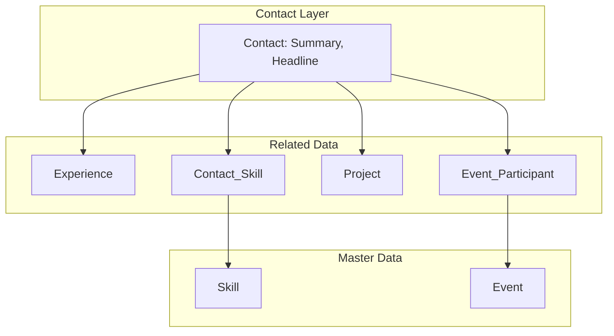
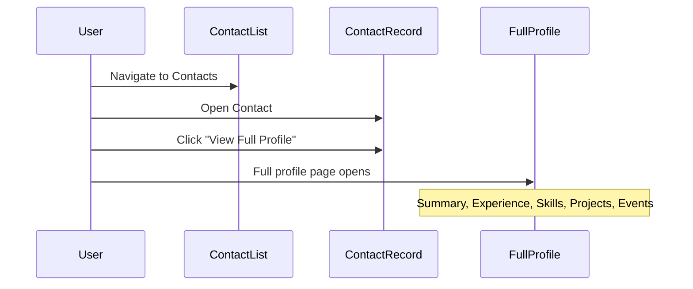

# Self Profile – Solution Document

**Document Version:** 1.0  
**Author:** Avanish Kumar  
**Date:** February 2025  
**Status:** Approved for Implementation

---

## 1. Business Context

### 1.1 Problem Statement

There is a need for a centralized, professional profile system that:

- Highlights work experience, skills, and projects (both public and private)
- Tracks event participation (speaking, volunteering, organizing)
- Can be expanded from a single profile (Avanish Kumar) to multiple contacts
- Uses standard Salesforce capabilities wherever possible to reduce maintenance

### 1.2 Business Goals

| Goal | Description |
|------|-------------|
| **Single Source of Truth** | One place to maintain professional profile data |
| **Visibility** | Full profile view accessible via a button on the Contact record |
| **Reusability** | Shared Skill library used across all contacts |
| **Flexibility** | Support for diverse participation types (speaker, volunteer, organizer) |
| **Scalability** | Architecture supports multiple contacts without redesign |

### 1.3 Stakeholders

- **Primary User:** Avanish Kumar (profile owner)
- **Future Users:** Additional contacts requiring similar profiles
- **Admins:** Salesforce administrators managing data and access

---

## 2. Requirements

For detailed Business Requirements (BR) and Non-Functional Requirements (NFR), see [docs/BR.md](BR.md) and [docs/NFR.md](NFR.md).

### 2.1 Functional Requirements

| ID | Requirement | Priority |
|----|-------------|----------|
| FR-1 | Store professional summary and headline on Contact | Must |
| FR-2 | Track work experience (title, company, dates, description) per Contact | Must |
| FR-3 | Maintain a shared Skill master list used by all contacts | Must |
| FR-4 | Link Contacts to Skills with proficiency level (Beginner–Expert) | Must |
| FR-5 | Track Projects (Public/Private) per Contact | Must |
| FR-6 | Support Events with multiple Contacts participating in roles (Speaker, Volunteer, Organizer, Panelist, Moderator) | Must |
| FR-7 | Provide a "View Full Profile" action on Contact that opens the complete profile | Must |
| FR-8 | Display Experience, Skills, Projects, and Events on the full profile page | Must |
| FR-9 | Use standard Salesforce components and features where possible | Should |

### 2.2 Non-Functional Requirements

| ID | Requirement |
|----|-------------|
| NFR-1 | Solution deployable via Salesforce Metadata API / SFDX |
| NFR-2 | No custom code required for core functionality (config-only) |
| NFR-3 | Compatible with standard Lightning Experience |
| NFR-4 | Data model supports future multi-contact expansion |

---

## 3. Solution Overview

### 3.1 High-Level Architecture

The solution is a **Contact-centric profile model** built on Salesforce:

- **Contact** is the central record; custom fields hold Summary and Headline.
- **Experience**, **Project**, **Contact_Skill**, and **Event_Participant** are custom objects with lookups to Contact.
- **Skill** is a shared master list; **Contact_Skill** is the junction linking Contact to Skill with proficiency.
- **Event** is a master list; **Event_Participant** is the junction linking Contact to Event with role.

### 3.2 Solution Diagram

### 3.3 User Flow

---

## 4. Detailed Solution Design

### 4.1 Contact Object Extensions

| Field | API Name | Type | Length | Required | Description |
|-------|----------|------|--------|----------|-------------|
| Summary | Summary__c | Long Text Area | 131072 | No | Professional summary |
| Headline | Headline__c | Text | 255 | No | Short tagline / headline |

### 4.2 Experience__c

| Field | API Name | Type | Required | Description |
|-------|----------|------|----------|-------------|
| Contact | Contact__c | Lookup(Contact) | Yes | Owner of experience |
| Title | Title__c | Text | Yes | Job title |
| Company | Company__c | Text | Yes | Company name |
| Start Date | Start_Date__c | Date | No | Start date |
| End Date | End_Date__c | Date | No | End date |
| Is Current | Is_Current__c | Checkbox | No | Ongoing role |
| Description | Description__c | Long Text | No | Role description |

### 4.3 Skill__c (Master List)

| Field | API Name | Type | Required | Description |
|-------|----------|------|----------|-------------|
| Name | Name | Text | Yes | Skill name |
| Category | Category__c | Picklist | No | Technical, Soft, Domain, Other |
| Description | Description__c | Long Text | No | Skill description |

### 4.4 Contact_Skill__c (Junction)

| Field | API Name | Type | Required | Description |
|-------|----------|------|----------|-------------|
| Contact | Contact__c | Lookup(Contact) | Yes | Contact |
| Skill | Skill__c | Lookup(Skill__c) | Yes | Skill from master list |
| Proficiency | Proficiency__c | Picklist | No | Beginner, Intermediate, Advanced, Expert |

### 4.5 Project__c

| Field | API Name | Type | Required | Description |
|-------|----------|------|----------|-------------|
| Name | Name | Text | Yes | Project title |
| Contact | Contact__c | Lookup(Contact) | Yes | Owner |
| Type | Type__c | Picklist | Yes | Public, Private |
| Description | Description__c | Long Text | No | Project description |
| URL | URL__c | URL | No | Link to repo/demo |
| Start Date | Start_Date__c | Date | No | Start date |
| End Date | End_Date__c | Date | No | End date |
| Is Current | Is_Current__c | Checkbox | No | Ongoing project |

### 4.6 Event__c

| Field | API Name | Type | Required | Description |
|-------|----------|------|----------|-------------|
| Name | Name | Text | Yes | Event title |
| Event Date | Event_Date__c | Date | No | Event date |
| Description | Description__c | Long Text | No | Event description |
| URL | URL__c | URL | No | Event link |
| Location | Location__c | Text | No | Venue / city |

### 4.7 Event_Participant__c (Junction)

| Field | API Name | Type | Required | Description |
|-------|----------|------|----------|-------------|
| Event | Event__c | Lookup(Event__c) | Yes | Event |
| Contact | Contact__c | Lookup(Contact) | Yes | Participant |
| Role | Role__c | Picklist | Yes | Speaker, Volunteer, Organizer, Panelist, Moderator |
| Topic | Topic__c | Text | No | Talk title or topic |

---

## 5. User Interface Design

### 5.1 Full Profile Page Layout

| Section | Component | Data Source |
|---------|-----------|-------------|
| Header | Record Detail | Contact (Name, Photo, Headline__c) |
| Summary | Record Detail | Contact (Summary__c) |
| Experience | Related List | Experience__c (Contact__c = recordId) |
| Skills | Related List | Contact_Skill__c (Contact__c = recordId) |
| Projects | Related List | Project__c (Contact__c = recordId), Type__c visible |
| Events | Related List | Event_Participant__c (Contact__c = recordId), Role__c visible |

### 5.2 View Full Profile Action

- **Type:** Lightning Action (or Custom Button)
- **Location:** Contact record page action bar
- **Behavior:** Navigate to Contact record with Full Profile page (or open dedicated App Page with Contact Id)

---

## 6. Technical Architecture

### 6.1 Deployment Model

- **Tool:** Salesforce DX (SFDX)
- **Format:** Metadata API (source format)
- **Version Control:** Git

### 6.2 Standard vs Custom

| Capability | Approach |
|------------|----------|
| Person record | Standard Contact |
| Page layout | Standard Lightning Record Page |
| Related lists | Standard Related List component |
| Record display | Standard Record Detail component |
| Navigation | Standard Lightning navigation / Quick Action |
| Custom objects | Custom objects (Experience, Skill, Contact_Skill, Project, Event, Event_Participant) |

### 6.3 Security Model

- **Sharing:** Default to org-wide defaults (OWD) for custom objects
- **Profiles:** Add custom object permissions to appropriate profiles
- **Permission Set:** Optional "Profile Manager" permission set for elevated access

---

## 7. Data Migration (If Applicable)

If Profile__c exists with data:

1. Export Profile__c (Contact__c, Summary__c, Headline__c)
2. Update Contact records with Summary__c and Headline__c
3. Deploy Contact field metadata
4. Remove Profile__c (after verification)

---

## 8. Testing Strategy

| Test Type | Scope |
|-----------|-------|
| Unit | N/A (configuration-only) |
| Integration | Create Contact → add Experience, Skills, Projects, Event participation → verify full profile |
| UAT | Profile creation, editing, full profile navigation |
| Regression | Standard Contact and related functionality |

---

## 9. Deployment Checklist

- [ ] Deploy Contact custom fields (Summary__c, Headline__c)
- [ ] Deploy/create Experience__c, Skill__c, Contact_Skill__c, Project__c
- [ ] Deploy Event__c, Event_Participant__c
- [ ] Create Full Profile Lightning record page
- [ ] Add View Full Profile action to Contact
- [ ] Assign Full Profile page to Contact in Lightning App
- [ ] Configure page layouts for all custom objects
- [ ] Run data migration (if removing Profile__c)

---

## 10. Future Enhancements

| Enhancement | Description |
|-------------|-------------|
| Public Profile Page | Experience Cloud site for public profile viewing |
| Certifications | Custom object for certifications with expiration |
| Education | Custom object for degrees/courses |
| Recommendations | Endorsements or recommendations from other Contacts |
| Export to PDF | Resume/portfolio export |
| Duplicate prevention | Validation for duplicate Contact_Skill, Event_Participant |

---

## 11. Appendix

### A. Picklist Values

**Skill.Category__c:** Technical, Soft, Domain, Other  
**Contact_Skill.Proficiency__c:** Beginner, Intermediate, Advanced, Expert  
**Project.Type__c:** Public, Private  
**Event_Participant.Role__c:** Speaker, Volunteer, Organizer, Panelist, Moderator  

### B. Object Relationships Summary

- Contact 1 : N Experience  
- Contact N : N Skill (via Contact_Skill)  
- Contact 1 : N Project  
- Contact N : N Event (via Event_Participant)  

### C. Document History

| Version | Date | Author | Changes |
|---------|------|--------|---------|
| 1.0 | Feb 2025 | Avanish Kumar | Initial solution document |
